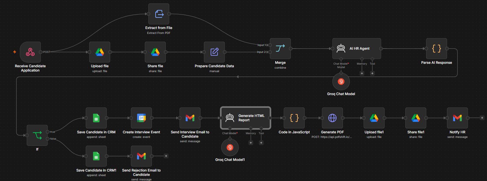
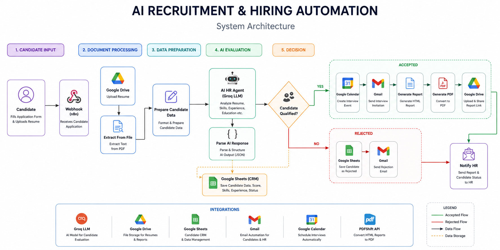

# AI Recruitment & Hiring Automation

<p align="center">


</p>

## Overview

AI Recruitment & Hiring Automation is an end-to-end recruitment workflow built with **n8n**, **Groq AI**, and **Google Workspace**. The system automates resume processing, candidate evaluation, interview scheduling, report generation, and HR notifications.

Instead of manually reviewing resumes, HR teams can upload candidate applications and receive an AI-generated hiring assessment within minutes.

This project demonstrates how AI and workflow automation can streamline recruitment while keeping human decision-making in the approval process.

---

# Features

- Resume upload through Webhook
- Automatic PDF resume extraction
- Resume parsing
- AI-powered candidate evaluation
- Candidate scoring (0–100)
- Hiring recommendation
- Seniority detection
- Skills extraction
- Strengths & weaknesses analysis
- Interview question generation
- HR approval workflow
- Automatic interview scheduling
- Google Calendar integration
- Gmail interview invitations
- Gmail rejection emails
- Professional HTML report generation
- PDF report generation
- Google Drive report storage
- Shareable report links
- Candidate CRM using Google Sheets

---

# Workflow Overview

The workflow follows the recruitment process below:

```
Candidate Application

        │
        ▼

Receive Resume (Webhook)

        │
        ▼

Upload Resume to Google Drive

        │
        ▼

Extract Resume Text

        │
        ▼

Prepare Candidate Data

        │
        ▼

AI HR Agent Analysis

        │
        ▼

Parse AI Response

        │
        ▼

Candidate Qualified?

      /     \
    Yes      No
    │         │
    ▼         ▼

Save CRM   Save CRM

    │         │
    ▼         ▼

Interview   Rejection Email

Calendar

    │
    ▼

Interview Email

    │
    ▼

Generate HTML Report

    │
    ▼

Generate PDF

    │
    ▼

Upload to Google Drive

    │
    ▼

Share Report

    │
    ▼

Notify HR
```

---

# Workflow Screenshot

> Replace this image with your workflow screenshot.



---

# System Architecture

> Replace this image with your architecture diagram.



---

# Technologies Used

| Technology | Purpose |
|------------|---------|
| n8n | Workflow Automation |
| Groq LLM | AI Candidate Evaluation |
| Google Drive | Resume & Report Storage |
| Google Sheets | Candidate CRM |
| Google Calendar | Interview Scheduling |
| Gmail | Email Automation |
| PDFShift API | PDF Report Generation |
| JavaScript | Data Processing |
| Webhooks | Candidate Submission |

---

# AI HR Evaluation

The AI HR Agent performs a complete candidate analysis.

It automatically identifies:

- Candidate information
- Technical skills
- Soft skills
- Education
- Experience
- Previous companies
- Certifications
- Projects
- Strengths
- Weaknesses
- Missing information
- Hiring recommendation
- Candidate score
- Candidate category
- Seniority level
- Interview questions

The AI always returns a structured JSON response for easy automation.

---

# Automated Report Generation

After the evaluation, the workflow automatically creates a professional HTML report containing:

- Candidate Information
- AI Evaluation
- Technical Skills
- Soft Skills
- Strengths
- Weaknesses
- AI Summary
- Suggested Interview Questions
- Resume Link

The HTML report is then converted into a PDF and uploaded to Google Drive.

---

# Google Workspace Integration

The workflow integrates with multiple Google services.

- Google Drive
- Google Sheets
- Gmail
- Google Calendar

These integrations allow recruiters to manage candidates without leaving the Google ecosystem.

---

# Repository Structure

```
AI-Recruitment-Hiring-Automation/
│
├── assets/
├── docs/
├── prompts/
├── workflow/
│
├── README.md
├── LICENSE
└── .gitignore
```

---

# Setup

Detailed setup instructions are available in:

```
docs/setup.md
```

The setup guide explains:

- Installing n8n
- Importing the workflow
- Configuring credentials
- Running the workflow

---

# Required Credentials

Configure the following credentials inside n8n.

- Google Drive
- Google Sheets
- Gmail
- Google Calendar
- Groq API
- PDFShift API

---

# Sample Screenshots

Replace these placeholders with your own screenshots.

## Candidate CRM

```
assets/screenshots/google-sheet.png
```

---

## Interview Email

```
assets/screenshots/interview-email
```

---

## Rejection Email

```
assets/screenshots/rejection-email
```

---

## Generated Report

```
assets/screenshots/pdf-report
```

---

# Example Output

The AI returns structured JSON similar to:

```json
{
  "candidate_name": "John Doe",
  "overall_score": 92,
  "rating": "Excellent",
  "category": "Excellent Fit",
  "seniority_level": "Senior",
  "recommended_for_interview": true
}
```

More examples are available in the **examples** folder.

---

# Business Value

This workflow helps organizations:

- Reduce manual resume screening
- Improve hiring speed
- Standardize candidate evaluations
- Reduce recruiter workload
- Automate interview scheduling
- Generate professional reports
- Keep recruitment data organized
- Improve hiring consistency

---

# Future Improvements

- ATS Integration
- LinkedIn Integration
- Multi-language Resume Parsing
- WhatsApp Notifications
- Slack Notifications
- Microsoft Teams Integration
- OCR Support
- Candidate Ranking Dashboard
- HR Analytics Dashboard

---

# Documentation

Additional documentation is available inside the **docs** folder.

- Architecture
- Setup Guide
- Workflow Explanation
- Integrations
- Customization Guide

---

# Prompts

The AI prompts used in this project are available in the **prompts** folder.

- AI HR Agent
- HTML Report Generator
- Email Templates

---

# Contributing

Contributions, improvements, and suggestions are welcome.

If you'd like to enhance this workflow, feel free to fork the repository and submit a pull request.

---

# License

This project is licensed under the MIT License.

See the **LICENSE** file for details.

---

# Author

**Love Kumar**

AI Automation Developer

Specializing in:

- AI Automation
- n8n Workflows
- LLM Integrations
- Business Process Automation
- Workflow Optimization

GitHub:
> https://github.com/lovekumar2005

LinkedIn:
> https://www.linkedin.com/in/love-kumar-23866a292/

---

## If you found this project helpful, don't forget to ⭐ star the repository!